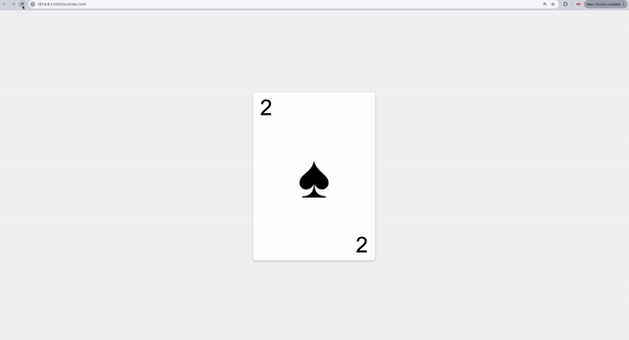

# Random Card Generator

Build a simple Random Card Generator that displays a new card with a random suit and value every time the page refreshes. This project is a fun way to practice HTML, CSS, and JavaScript while learning how to dynamically update content on a webpage. 🎴

🗒️ **How to Start This Project?**
---
1. **Ensure You Have a GitHub Account**
   If you don't have one, sign up at [https://github.com](https://github.com/).
2. Navigate to the project template
   - Create a repository from the template to your account
   - Open the project with a new codespace
   - Once you did it once you can open the codespace that was previously created.
---

📝 **Instructions**
---
Your task is to create an algorithm that generates a random card every time the page loads. The card will feature a random value (e.g., Ace, 2, King) and a random suit (e.g., Spades, Hearts).

## Here’s what your project should do:
1.	Dynamically generate a random card value (2-10, J, Q, K, A) and suit (♥, ♦, ♣, ♠) on each page load.
2.	Apply the appropriate styles:
    - Red suits: Hearts (♥) and Diamonds (♦)
    - Black suits: Spades (♠) and Clubs (♣)
3.	Style the card visually using CSS.

Here is an example:

---

### Hints:
- Generate random numbers for:
- Card values: Use arrays and random indicies to pick values like 2-10, J, Q, K, A.
- Suits: Use arrays and random indicies to pick between Hearts, Spades, Diamonds, and Clubs.
- Use HTML entities or Unicode for the suit symbols (You can copy them from here) 
    `["♥", "♦", "♠", "♣"]`

### **🤔 What to Do If You Are Stuck?**
#### **Review Fundamentals:**
- Review the JS materials covered.
#### **Ask for Help:**
- Reach out to your instructor or peers for assistance

---
### **📚 Fundamentals Covered**
#### This exercise covers the following fundamentals:
1.	HTML Basics 
- Structuring the card display dynamically.
2. CSS 
- Styling the card with appropriate colors, borders, and suits.
- Adding responsive or interactive styling.
3.	JavaScript Basics
- Using arrays for card values and suits.
- Generating random numbers with Math.random().
- Dynamically manipulating the DOM to display the card.
---
